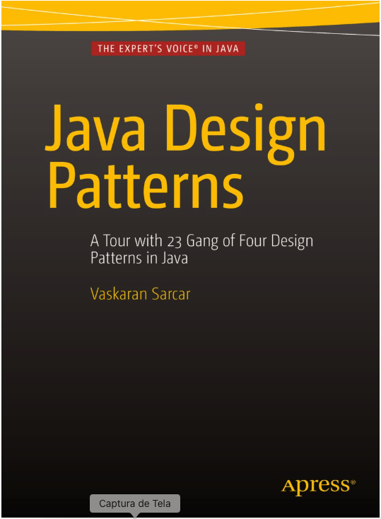

# Java Design Patterns:A tour of 23 gang of four design patterns in Java

Implementation of the examples presented in the book Design Patterns [Java Design Patterns](https://www.amazon.com.br/Design-Patterns-English-Vaskaran-Sarcar-ebook/dp/B01JFVAICY).

**A.** Creational Patterns:
These patterns mainly deal with the instantiation process. Here we make the systems independent from how their objects are created, collected, or represented. The following five patterns fall into this category:       

[x] Singleton Pattern 
[ ] Abstract Factory Pattern 
[x] Prototype Pattern 
[x] Factory Method Pattern 
[x] Builder Pattern

**B.** Structural Patterns:
Here we focus on how objects and classes are associated or can be composed to make relatively large structures. Inheritance mechanisms are mostly used to combine interfaces or implementations. The following seven patterns fall into this category:

[ ] Proxy Pattern 
[ ] Flyweight Pattern 
[ ] Bridge Pattern 
[x] Facade Pattern 
[x] Decorator Pattern 
[x] Adapter Pattern 
[ ] Composite Pattern

**C.** Behavioral Patterns:
Here our concentration is on algorithms and the assignment of the critical responsibilities among the objects. We also need to focus on the communication between them. We need to take a closer look at the way those objects are interconnected. The following 11 patterns fall into this category.

[x] Observer Pattern 
[ ] Template Method Pattern 
[x] Command Pattern 
[x] Iterator Pattern 
[x] State Pattern 
[x] Mediator Pattern 
[x] Strategy Pattern 
[ ] Chain of Responsibility Pattern 
[ ] Visitor Pattern 
[ ] Interpreter Pattern 
[x] Memento Pattern

